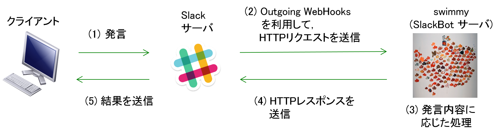

# swimmy
swimmyとは，B4新人課題で作成した各々のSlackBotを1つにまとめたものである．本プロジェクト名は，絵本作家レオ・レオニ作の絵本「swimmy」に由来し，各々のプログラムをまとめた1つの成果物を表している．

# Description
## How it works
本プログラムは，SlackBot プログラムである．チャットツールである [Slack](https://slack.com/) 上で発言された内容に応じた処理を行う．Slack 上での発言を契機に SlackBot プログラムが処理し，処理結果を Slack に発言するまでの処理の流れを以下に示す．



1. クライアントは Slack サーバに POST する．
2. Slack サーバは Outgoing WebHooks を用いて SlackBot サーバに POST する．
3. SlackBot サーバは POST された発言内容に応じた処理を行う．
4. SlackBot サーバは処理結果をレスポンスとして返す．
5. Slack サーバはクライアントに結果を送信する．

## Function
本プログラムは以下に示す機能を提供する．

- ユーザが"「〇〇」と言って"と発言すると，SlackBotが"〇〇"と発言する機能
- 移動手段，出発地点，および到着地点から以下の情報を発言する機能 
  - 出発地点から到着地点までの距離
  - 出発地点から到着地点までの移動にかかる時間
  - 出発地点から到着地点までの経路の詳細を示した Google Map へのリンク
- 直近60分後の降水強度予測を発言する機能 
- 設定された GitHub リポジトリに issue を作成，または issue の一覧を発言する機能
- 入力された飲食店の情報を発言する機能 
- 上記のどの機能にも該当しない場合に使用方法を発言する機能


# Settings
- このリポジトリを clone する．

  ```
  $ git clone https://github.com/nomlab/swimmy.git
  ```

- gem のインストール
  - 以下のコマンドを実行し，gemをインストール
 
   ```
   $ gem install bundler
   $ bundle install --path vendor/bundle
   ```

- Outgoing WebHooks の設定
  - [Custome Integrations](https://nomlab.slack.com/apps/manage/custom-integrations) へアクセスし，「Outgoing WebHooks」をクリック
  - 「Add Configuration」から，新たな Outgoing WebHook を追加
  - 「Add Outgoing WebHooks integration」をクリック
  - Outgoing WebHook に関して以下を設定
    - Channel: 発言を監視する channel
    - Trigger Word(s): WebHook が動作する契機となる単語
    - URL(s): WebHook が動作した際にPOSTを行うURL
  - 必要であれば， Customize Name もしくは Customize Icon を設定
  
- APIキーの取得
  - Google Maps API の API キー取得
    - [Google Maps API](https://developers.google.com/maps/web/) へアクセスし，「キーの取得」をクリックする．
    - 「Select or create project」をクリックする．
    - 「Create a new project」をクリックし，プロジェクト名を付ける．
    - 「NEXT」をクリックすると，Google Maps APIキーが作成される．
    
  - Google Places API の API キー取得
    - [Google Place API](https://developers.google.com/places/web-service)へアクセスし， 「キーの取得」をクリックする．
    - 「Create a new project」を選択し，プロジェクト名を決定する．
    - 「Next」をクリックすると API キーが生成される．

  - Yahoo! JAPAN デベロッパーネットワーク Web API の Client ID の取得
    - [Yahoo! JAPAN デベロッパーネットワーク](https://developer.yahoo.co.jp/)にアクセスする．
    - ページ上部の「機能」をクリックし，「アプリケーションの開発」をクリックする．
    - 本プログラムの使用者の Yahoo!JAPAN アカウントにログインする．
    - 「新しいアプリケーションの開発」をクリックする．
    - アプリケーション情報を入力し，「ガイドラインに同意する」にチェックを入れ，「確認」をクリックする．
    - Client ID を取得する．なお，Client ID を API キーとして用いる．

- 本プログラムは Heroku を用いて SlackBot を動作させることを想定している．
  - Heroku の設定については [Heroku の利用手順](https://github.com/nomlab/nompedia/wiki/Tips#heroku%E3%81%AE%E5%88%A9%E7%94%A8%E6%89%8B%E9%A0%86)を参照

- Heorku-CLI を用いて API キーと GitHub のログイン ID と パスワードを Heroku の環境変数に追加する．

  ```
  $ heroku config:set <KEY_NAME> = "XXXXXXXXXXXX"
  ```

- ローカルで実行する場合，次の手順で環境変数を設定する．
  - 以下のコマンドを実行し，settings.yml.sample を settings.yml に変更

    ```
    $ cp settings.yml.sample settings.yml
    ```

  - 取得した API キー，ログインID，パスワードを settings.yml に以下の形式で書き込む．

    ```
    <key_name>: XXXX
    ```


# Run
- Heroku 上で動作させる場合
  - Heroku へのデプロイ方法については [Heroku の利用手順](https://github.com/nomlab/nompedia/wiki/Tips#heroku%E3%81%AE%E5%88%A9%E7%94%A8%E6%89%8B%E9%A0%86)を参照

- ローカルで実行する場合
  - 以下のコマンドを実行する．

    ```
    $ bundle exec rackup config.ru
    ```

# Add your SlackBot to swimmy
本プログラムは，作成した各々の機能を module として追加し，Swimmy.rb で include して発言内容に応じて呼び出す．
- 機能の追加に必要な API キー等の非公開情報を設定する．
  - ローカルで実行するためには settings.yml に書き込む．
  - Heroku 上で動作させるためには環境変数を設定する．
- SlackBot.rb でAPIキー等を以下の形式で呼び出す．

  ```
  @<variable> = ENV['<KEY_NAME>'] || @config["<key_name>"]
  ```

- 追加する機能を実装した module を作成する．
- Swimmy.rb に作成した module を include し，特定の文字列が POST された際に，この module を呼び出す処理を追加する．
- Swimmy.rb に使用方法を記述する．


# Test

- Slack や他の Web サービスの Outgoing WebHooks を用いた機能のテストをローカルで行いたい場合， test ディレクトリ以下の post_test.rb を利用する．

- Outgoing WebHooks によって POST される内容を test/test.json に記述．

- 上述の「Run」に示す，ローカルで実行する場合の手順に従った上で，以下のコマンドを用いる．

  ```
  $ ruby test/post_test.rb http://localhost:<port>/<path> test/test.json
  ```

  - 上記のコマンドでは，第1引数にPOST先URL，第2引数にPOSTするJSONが格納されているファイルパスを指定する．